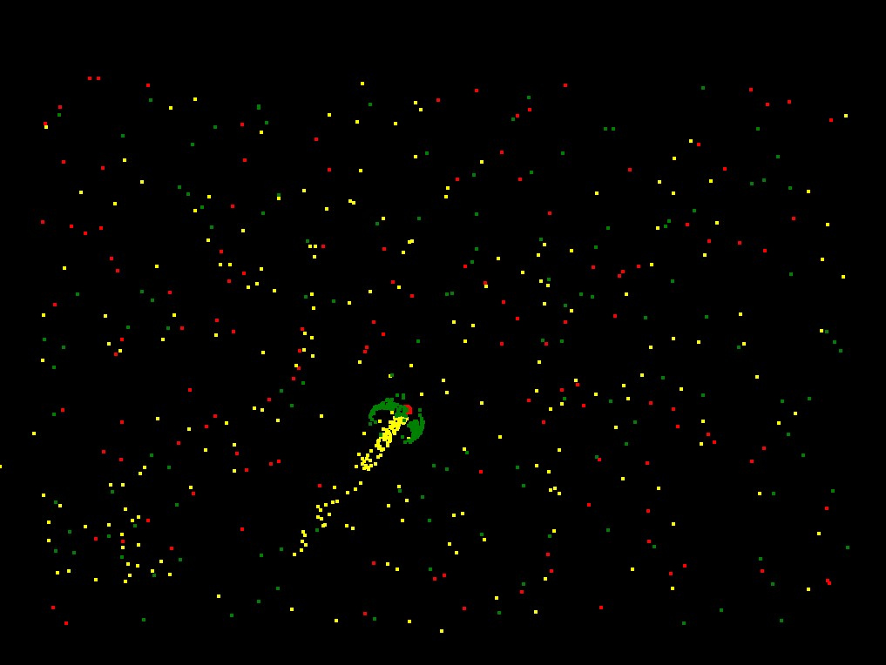

# Particle Life Simulation Go version

This is a go vesion of the Particle Life Simulation made by hunar4321.

## Original creation
[Particle Life Simulation by hunar4321](https://github.com/hunar4321/particle-life)

## Description creation
A simple program to simulate primitive Artificial Life using simple rules of attraction or repulsion among atom-like particles, producing complex self-organzing life-like patterns. Excluding the GUI elements, the code is less than a page.

### Screenshot

## installation
Pull repo into go workspace, build and run!

### requirments
[Pixel by faiface](https://github.com/faiface/pixel)
